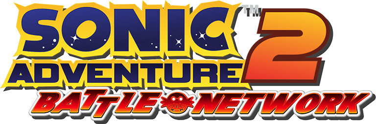

  

# Sonic Adventure 2: Battle Network
*Sonic Adventure 2: Battle Network* is a netplay mod for *Sonic Adventure 2 PC* which utilizes the [SA2 Mod Loader](https://github.com/sonicretro/sa2-mod-loader) perform code injection and implement hooks to track changes to critical gameplay data and synchronize that data over the internet.

## Usage
To play *Sonic Adventure 2 PC* online, you must first install the following pre-requisites:

### Pre-requisites:
* [SA2 Mod Loader](https://info.sonicretro.org/SA2_Mod_Loader) ([source](https://github.com/sonicretro/sa2-mod-loader))
* [Microsoft Visual C++ Redistributable for Visual Studio 2015, 2017 and 2019 (**x86**)](https://aka.ms/vs/16/release/vc_redist.x86.exe)

You will need to run the game with command-line arguments. You can do this via command-line interface, or by creating a shortcut to `sonic2app.exe` and adding them to the end of the "Target" field.

### Hosting a game server
* Choose a port. We will use `27015` as an example.
* Ensure that the port is open on your router.
* Run the game with the following parameters:
  * `--host 27015`
* Enter the 2P BATTLE menu. The music should change to reflect hosting status. DO NOT press start for player 2.
* When player 2 connects, a success jingle will play, and the game will wait for both players to press the Accept button (A).

### Joining a game server
* Get the *address* of the server you are connecting to. We will use `127.0.0.1`.
* Get the *port* of the server you are connecting to. We will use `27015`.
* Run the game with the following parameters:
  * `--connect 127.0.0.1:27015`

### All command-line parameters
| Parameter | Offline | Client | Server | Description |
|-----------|---------|--------|--------|-------------|
| `--host port` or `-h port` | N/A | N/A | N/A | Host a server on the specified port. |
| `--connect address:port` or `-c address:port` | N/A | N/A | N/A | Connect to a server at `address` on port `port`. |
| `--no-specials` | ✔ | ❌ | ✔ | Disable all special abilities given by rings (speed up, etc.). |
| `--cheats` | ❌ | ❌ | ✔ | Allows you to teleport to the other player by pressing Y + D-Pad Up. Also enables built-in cheats. |
| `--netstat` | ❌ | ✔ | ✔ | Enables network statistic logging. Saves as `netstat.recv.csv` and `netstat.sent.csv` in the game directory. |

## Compiling
### Requirements
* Visual Studio 2019 or newer

### Build
1. Open `SA2 Battle Network.sln` in Visual Studio 2019
2. Build!
